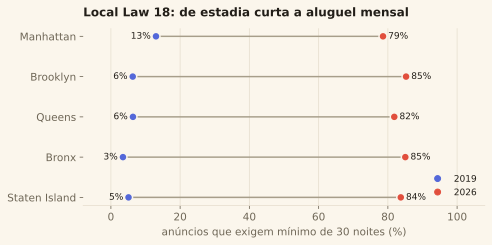
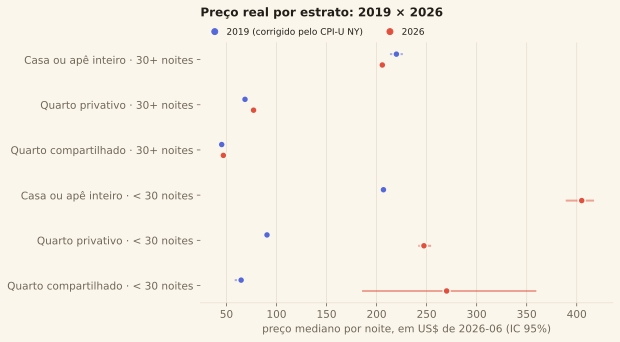

# Comparativo 2019 → 2026

> Entre o entendimento dos dados (fase 2) e a avaliação (fase 5): o que mudou no
> Airbnb de Nova York entre o dataset do Kaggle (julho de 2019) e o snapshot mais
> recente do Inside Airbnb (junho de 2026). Código em `src/airbnb/eda/comparativo.py`;
> números em `data/processed/_comparativo.json`.

## 1. As duas regras (ADR 0005)

1. **Dólar constante.** Todo preço de 2019 é levado a dólar de 2026 pelo CPI-U da
   região metropolitana de Nova York (BLS `CUURS12ASA0`) — não pelo índice nacional:
   o custo de vida de NYC não seguiu a média do país.
2. **Estratificar pelo mínimo de noites.** Depois da Local Law 18, estadia de menos
   de 30 noites exige registro — e o `price` de um anúncio de 30+ noites é a cotação
   de uma estadia mensal, com desconto. Comparar medianas agregadas mede a mudança
   de **composição**, não de preço.

## 2. O mercado encolheu e mudou de natureza

--8<-- "_snippets/tabela_kpis.md"

Três leituras:

- **Menos anúncios, muito menos anfitriões.** O número de anúncios caiu 38%; o de
  anfitriões, 56%. Quem ficou tem mais anúncios cada um.
- **Profissionalização.** Anúncios de anfitrião com dois ou mais anúncios passaram de
  34% para 56% do mercado; o 1% de anfitriões com mais anúncios detinha 10% da oferta
  em 2019 e detém 25% em 2026. Anfitriões com 51 ou mais anúncios respondem por 15%
  dos anúncios (eram 2,7%). O "morador que aluga o quarto de vez em quando" deixou de
  ser o caso típico.
- **De estadia curta a aluguel mensal.** O mínimo de 30 noites passou de exceção (9%)
  a regra (82%), em todos os distritos. É o efeito que a Local Law 18 desenhou, e ele
  aparece no dado — ver a ressalva causal em [Avaliação](08-avaliacao.md) §2.
- **Não foi atrito: foi substituição.** "48.895 → 30.257" sugere que o mercado de hoje
  é um subconjunto do de 2019. Não é. Só **24,8%** dos anúncios atuais existiam em
  2019; outros 17,7% são novos de anfitriões que já estavam lá; e **57,5% são de
  anfitriões que não existiam em 2019**. Dos 37.457 anfitriões de 2019, só **19%**
  ainda anunciam. Mais da metade do mercado atual é gente que chegou depois da lei.
- **A oferta efetiva caiu bem mais que 38%.** Contar anúncios superestima o que
  restou, porque dois terços da base de 2026 não recebe hóspede. Somando as noites
  efetivamente ocupadas (`ocupacao_modelo`, mesma fórmula nas duas safras), a oferta
  vai de **14.021 para 5.705 anúncios-ano equivalentes: −59,3%**.

## 3. Preço real, estrato por estrato

--8<-- "_snippets/tabela_estratos.md"

A leitura por estrato desfaz a impressão da mediana agregada. **Quem aluga por 30+
noites cobra hoje, em dólar constante, praticamente o mesmo que em 2019.** A alta está
toda na **estadia curta** — que depois da LL18 ficou legal só para anfitrião
registrado, morando no imóvel, ou para hotel: oferta escassa e cara. Os intervalos de
confiança (bootstrap da mediana) mostram que as variações não são ruído.

## 4. Composição × preço: a decomposição

A variação da **média geométrica** do preço real (média do log) se decompõe
exatamente em duas parcelas:

$$
\Delta \;=\; \underbrace{\sum_e (w^{26}_e - w^{19}_e)\,\mu^{19}_e}_{\text{composição}}
\;+\; \underbrace{\sum_e w^{26}_e\,(\mu^{26}_e - \mu^{19}_e)}_{\text{preço dentro do estrato}}
$$

onde \(e\) é o estrato (mínimo de noites × tipo de quarto), \(w\) o peso do estrato no
snapshot e \(\mu\) a média do log do preço real no estrato.

--8<-- "_snippets/tabela_decomposicao.md"

A migração em massa para 30+ noites quase não mexeu na média: em 2019 os dois
estratos já tinham preços parecidos, então trocar um pelo outro custa pouco. Quase
toda a variação é **preço dentro do estrato** — e, pela tabela da seção 3, ela vem da
estadia curta, que encolheu de 91% para 18% dos anúncios e ficou muito mais cara.

## 5. Por distrito

--8<-- "_snippets/tabela_distritos.md"

Manhattan e Brooklyn, o núcleo turístico, perderam 37% e 47% dos anúncios; Queens,
Bronx e Staten Island, entre 11% e 17%. Alguns bairros periféricos de Queens e do
Bronx **cresceram** (Laurelton, Edenwald, Cambria Heights mais que dobraram, a partir
de bases pequenas). É compatível com a oferta migrando para onde o aluguel mensal
mobiliado tem demanda residencial, não turística — hipótese, não teste: o dado não
diz quem aluga. Lista completa por bairro em `_comparativo.json` → `por_bairro`.

## 6. O mercado registrado

Quem ainda anuncia estadia curta em 2026 precisa de registro na Office of Special
Enforcement (OSE). No snapshot, **7,7% dos anúncios exibem número de registro**
(`OSE-STRREG-…`) e 9,8% se declaram isentos (hotéis e similares); 82,5% não informam —
e quase todos esses são de 30+ noites, que não exigem registro. Entre os anúncios de
estadia curta, 41% são registrados, 52% isentos e **6,6% não têm registro nem isenção**.
Os relatórios anuais da OSE contam 105 registros ativos ao fim do primeiro ano fiscal da
lei (jun/2023) e 3.338 em jun/2026. O denominador desses 3.338 **não são os 30 mil
anúncios** — 82% deles exigem 30+ noites e não precisam de registro. São os 5.540 de
estadia curta: **3.338 sobre 5.540 é 60%**, não 11%. A lei é cumprida por quem está no
alcance dela; o que ela fez foi empurrar o mercado para fora desse alcance. Fonte e linha do tempo em
[Fontes externas](03-fontes-externas.md); a densidade de registros por distrito do
Conselho está no mapa.

## 7. No mapa

As métricas por célula H3 r8 (anúncios, variação, preço, 30+ noites, sobrevivência,
valorização ajustada) estão no [mapa](https://felipe44776-eseg.github.io/data-science-2-eseg-airbnb-nyc/mapa/) — seletor "métrica". A variação de preço
bruta por célula mistura composição; a **valorização ajustada** — calculada, desde a
revisão de método, **dentro do estrato de 30+ noites** — é o resíduo do modelo de
2019, ver [Modelagem](07-modelagem.md) §5) é a leitura correta.
