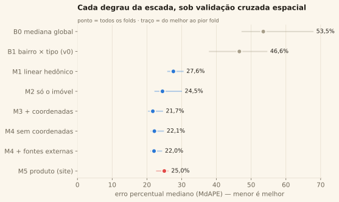
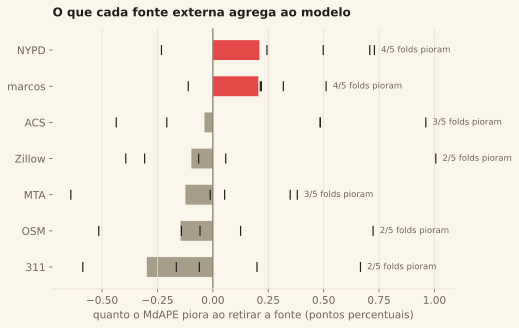
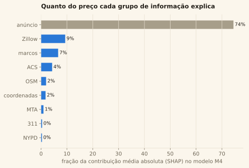
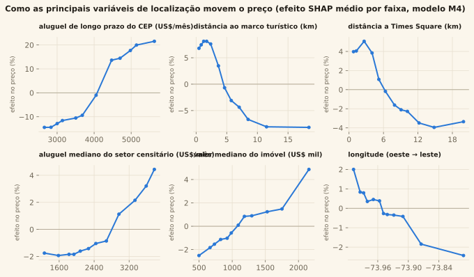
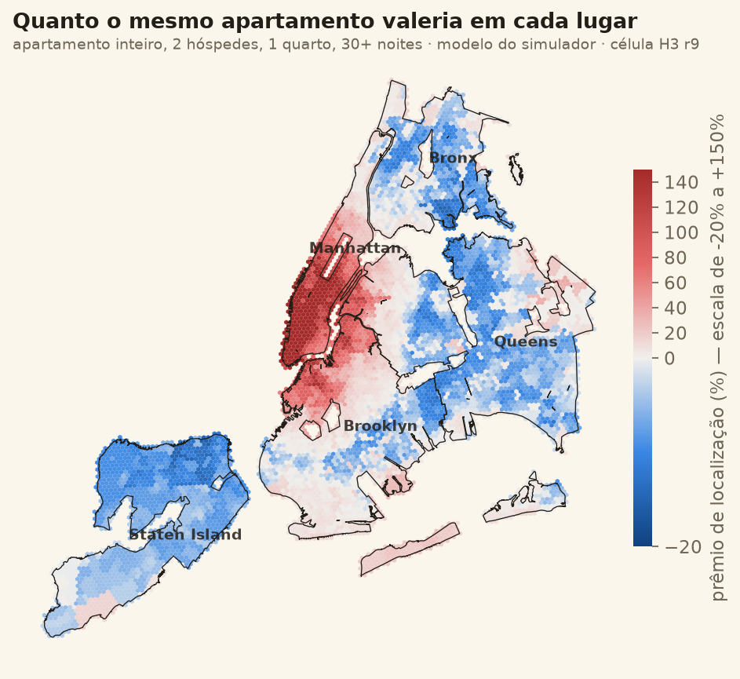
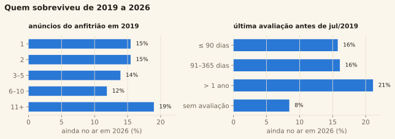
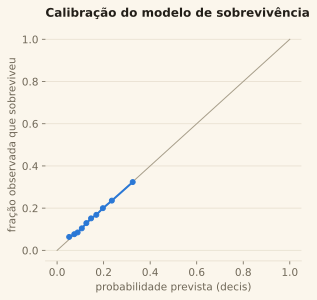
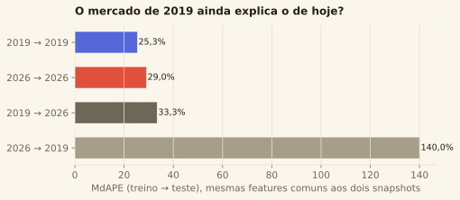

# 4 · Modelagem

> Fase 4 do CRISP-DM. Quatro modelos, um para cada objetivo de mineração de
> [docs/01](01-entendimento-do-negocio.md) §4 — todos validados por **bloco
> espacial** (ADR 0002). Código em `src/airbnb/models/`; features em
> `src/airbnb/models/especificacao.py`, a fonte única de quais colunas entram em
> cada modelo.

## 1. Como tudo é validado

**Validação cruzada espacial.** Os anúncios são agrupados pela célula H3 r6
(~36 km²) em que caem; os blocos são sorteados em 5 folds; todo anúncio de um bloco
fica no mesmo fold. O modelo nunca vê, no treino, os vizinhos do anúncio que está
prevendo — que é a situação do simulador do site.

**Parada antecipada honesta.** O LightGBM escolhe o número de árvores numa
validação separada **do treino** (15% dos blocos de treino), nunca no fold de teste.
O modelo final usa a mediana das árvores escolhidas nos 5 folds.

**Métricas.** Em dólar (MAE, erro absoluto mediano), relativa (MdAPE, o erro
percentual mediano — comparável entre um quarto de US$ 60 e uma cobertura de
US$ 900) e R² no log do preço, onde o modelo é ajustado. Toda métrica é **fora do
fold**. A dispersão entre folds acompanha cada número.

**Quanto a validação ingênua enganaria.** O modelo principal (M4) é rodado uma
vez também com KFold aleatório; a diferença é o otimismo que teríamos publicado
(seção 2.4).

## 2. Preço por noite — modelo hedônico

### 2.1 A escada

Cada degrau só existe se melhorar o anterior — e a escada mostra *de onde* vem
cada ganho.

| degrau | o que vê | papel |
|---|---|---|
| B0 | nada (mediana global) | piso |
| B1 | mediana por bairro × tipo de quarto | o que a análise descritiva (v0) sabe; recua para o tipo quando o bairro não está no treino |
| M1 | regressão linear regularizada (Ridge) no log do preço | o clássico da literatura hedônica |
| M2 | LightGBM com os atributos do anúncio | o imóvel, sem a localização |
| M3 | M2 + coordenadas do centroide da célula r9 + distrito | a localização como latitude/longitude |
| M4 | M3 + as fontes externas | a localização como **o que há nela** |
| M4 sem coordenadas | M2 + distrito + fontes externas | as externas **substituem** a coordenada? |
| **M5** | só as entradas do simulador + localização, modelo compacto | **o produto** que roda no navegador |

Atributos do anúncio (M2): estrutura (tipo de quarto e de imóvel, hóspedes,
quartos, camas, banheiros, banheiro compartilhado), 17 comodidades, regras
(mínimo de noites, 30+ noites, situação do registro na Prefeitura), anfitrião
(superhost, anos como anfitrião, número de anúncios) e avaliações (nota geral, de
limpeza e de localização, número de avaliações, meses desde a primeira).

**O produto (M5)** usa só o que um usuário sabe informar — tipo, hóspedes,
quartos, camas, banheiros, banheiro compartilhado, 30+ noites, superhost e nota
(opcional) — mais tudo o que vem da célula. É menor (árvores de 31 folhas) para
caber no navegador; o custo em erro frente ao M4 está na tabela.

--8<-- "_snippets/tabela_escada.md"

**Leitura.** A análise descritiva (B1) erra metade do preço (MdAPE 46,6%): sob CV
espacial, o bairro do anúncio quase nunca está no treino e o baseline recua para a
mediana do tipo de quarto. O modelo linear clássico já corta o erro quase pela
metade (27,6%); o LightGBM só com o imóvel chega a 24,5%, e a localização leva a
21,7–22,0%. O produto, compacto (61 árvores de 31 folhas, 34 features), fica em
**25,0%** — 3 pontos acima do M4, o preço de caber no navegador.

**Quanto a validação ingênua enganaria.** O mesmo M4 avaliado com KFold aleatório
dá MdAPE de **18,5%** e R² de 0,80 — contra 22,0% e 0,76 com blocos espaciais. Teríamos
publicado um erro 16% menor do que o real para quem usa o simulador num lugar novo.

### 2.2 O que cada fonte externa agrega (ablação)

Retira-se **uma** fonte externa por vez do M4 e mede-se quanto o erro piora, fold
a fold. Fonte cuja retirada piora o erro em 4 ou 5 dos 5 folds agrega de forma
consistente; a que piora em 2 ou 3 é ruído.

--8<-- "_snippets/tabela_ablacao.md"

!!! warning "Resultado nulo, reportado como tal"
    **Para prever preço, as fontes externas não superam as coordenadas.** O M4 (com as
    externas) empata com o M3 (só latitude/longitude): 22,0% × 21,7%, melhor em 3 de 5
    folds — o critério C4, registrado antes da modelagem, **não foi atendido**. Só a
    retirada de NYPD e dos marcos piora o erro de forma consistente (4/5 folds), e em
    0,2 ponto percentual.

    O que as externas fazem é **substituir** a coordenada quase sem perda (M4 sem
    coordenadas: 22,1%) — e, com isso, dizer *o que* no lugar importa. No M4, o modelo
    prefere as externas às coordenadas: 25,5% da contribuição SHAP vai para
    características do lugar e só 1,7% para latitude/longitude (seção 2.3). O ganho da
    busca por dados fora do Kaggle, no preço, é de **interpretação e de transferência**
    (um modelo que fala em aluguel, renda e distância a marcos funciona em outra
    cidade; um que fala em latitude, não), não de acurácia. Onde elas mudam a conclusão
    é em outros lugares: o comparativo de aluguel (seção 3) e o
    [teste de localização](06-testes-de-localizacao.md).

### 2.3 O que move o preço (SHAP)

A contribuição SHAP soma exatamente a previsão, então pode ser agregada por grupo
sem dupla contagem: é a resposta direta a "quanto do preço é o imóvel e quanto é o
lugar".

--8<-- "_snippets/tabela_shap_grupos.md"

O imóvel explica três quartos do preço — banheiro compartilhado, número de hóspedes,
mínimo de noites e situação do registro na Prefeitura estão entre as seis features que
mais movem a previsão. Do quarto restante, o que mais pesa é o **nível de aluguel de
longo prazo do CEP** (Zillow ZORI: a terceira feature do modelo), seguido da distância
aos marcos turísticos e da renda e do aluguel do setor censitário (Census).

As curvas têm a forma esperada — e isso é validação: preço sobe com o aluguel do
entorno (de −15% a +22% entre os extremos do ZORI), cai com a distância aos marcos
(+8% perto, −8% a mais de 10 km) e com a distância a Times Square.

O mapa aplica o modelo do simulador a um mesmo apartamento de referência em cada
célula r9: é o **prêmio de localização** que o site calcula para um clique.

### 2.4 Intervalo de previsão conformal

O simulador não publica só um número: publica uma faixa que contém o preço real de
80% dos anúncios parecidos. O intervalo é **conformal**: os quantis 10% e 90% do
resíduo fora do fold (no log) viram a faixa `[p·e^q_inf, p·e^q_sup]`, com a correção
de amostra finita. A **cobertura honesta** é medida calibrando em 4 folds e
conferindo no quinto.

Um intervalo global cobre 80% na média, mas descobre os grupos pequenos (quarto de
hotel, quarto compartilhado), que erram mais. Por isso o produto usa o conformal
**de Mondrian**: um par de quantis por tipo de acomodação.

--8<-- "_snippets/tabela_conformal.md"

O intervalo global cobre 79,6% no total, mas só 68% dos quartos de hotel e 63% dos
compartilhados. O Mondrian (grupo com pelo menos 100 resíduos) traz os quatro tipos para
78–80%. A faixa é larga — no intervalo global, o limite superior é cerca de 2,6 vezes
o inferior —, e é isso que o erro fora do lugar conhecido realmente é.

### 2.5 O produto por recorte

--8<-- "_snippets/tabela_produto_estratos.md"

## 3. Ocupação e receita

O alvo é `estimated_occupancy_l365d`, estimativa do Inside Airbnb **reproduzida
exatamente** pela limpeza: `min(round(avaliações_12m ÷ 0,5 × max(6,4; mínimo de
noites)); 255)`. É modelo de outro modelo, e dizemos isso: prevê quantas noites um
anúncio parecido *acumula de avaliações*, não reservas observadas.

O problema se parte em dois, porque mais da metade dos anúncios com preço não teve
hóspede nenhum no ano — estão listados, não operados:

1. **o anúncio está ativo?** (classificação, AUC);
2. **se ativo, quantas noites?** (regressão no log das noites) — o número que o
   simulador mostra, porque quem pergunta "quanto fatura" pretende operar.

--8<-- "_snippets/tabela_ocupacao.md"

**Atividade.** 80% dos anúncios de estadia curta tiveram hóspede no último ano; dos de
30+ noites, só 35%. Prever se um anúncio está ativo é fácil (AUC 0,91) — o mínimo de
noites e o tipo praticamente decidem. **Noites, se ativo**, é mais difícil: o modelo
erra 58 noites em média (48,5 na mediana) contra 62 do baseline, e ordena bem melhor
(Spearman 0,59 × 0,34). 28% dos anúncios ativos estão no teto de 255 noites da
estimativa. A receita prevista (preço do produto × noites) tem Spearman de 0,79 com a
observada.

**Penalidade de sobrepreço.** Entre anúncios ativos de estadia curta, os que cobram
20% ou mais acima do que o modelo de preço prevê para eles ficam, na mediana, com 205
noites no ano — contra 255 dos demais. Nos de 30+ noites a diferença some (122 × ~128
noites em média). A correlação geral é nula (Spearman −0,004): o mercado só pune o
sobrepreço forte, e só na estadia curta.

### 3.1 O Airbnb fatura mais que o aluguel tradicional?

A pergunta que liga o Airbnb à habitação: um apartamento inteiro, anunciado e ativo,
fatura mais no Airbnb do que alugado por um ano no mercado tradicional do mesmo CEP?
Receita = `estimated_revenue_l365d` (bruta: sem taxa da plataforma, limpeza nem
mobília); aluguel = Zillow ZORI do CEP × 12, em dólar de junho de 2026.

| recorte | apartamentos ativos | receita ÷ aluguel anual (mediana) | faturam mais que o aluguel |
|---|---:|---:|---:|
| todos | 5.069 | 0,55 | 27,7% |
| estadia curta (< 30 noites) | 1.433 | **1,69** | **74,8%** |
| 30+ noites | 3.636 | 0,42 | 9,1% |

A Local Law 18 dividiu o mercado em dois negócios opostos: a estadia curta **legal**
(registrada) é muito mais rentável que o aluguel — três em quatro superam um ano de
aluguel —, enquanto o aluguel mensal mobiliado pelo Airbnb fatura, na mediana, menos
da metade de um aluguel tradicional. Parte dessa distância é método: a ocupação
estimada de 30+ noites conta 60 noites por avaliação, e hóspedes de estadia longa
avaliam menos — a receita desse grupo tende a estar subestimada. Por distrito e no
[mapa](https://felipe44776-eseg.github.io/data-science-2-eseg-airbnb-nyc/) (métrica
"Airbnb × aluguel de longo prazo").

## 4. Sobrevivência 2019 → 2026

"Sobreviver" = o **mesmo id** de anúncio de julho de 2019 aparecer em junho de 2026.
Não é o mesmo que o imóvel continuar alugado: o anfitrião pode ter recriado o
anúncio, e o scrape pode não capturar um anúncio ativo — os dois contam como "não
sobreviveu".

Dois modelos, dois papéis:

- **regressão logística** com erro-padrão **agrupado por anfitrião** (anúncios do
  mesmo anfitrião saem juntos; sem agrupar, o intervalo de confiança fingiria mais
  informação independente do que há) — para razões de chance interpretáveis;
- **LightGBM** sob CV espacial — para medir quanto do destino é previsível e
  desenhar o mapa de sobrevivência prevista.

Dos 48.895 anúncios de julho de 2019, **7.516 (15,4%)** ainda estão no ar em junho de 2026.

--8<-- "_snippets/tabela_sobrevivencia_or.md"

Referências: casa ou apê inteiro e Bronx. Controlando pelo resto, **sobreviveu mais quem
já era aluguel mensal em 2019** (mínimo de 30+ noites: chance 2,1 vezes maior — já estava
dentro da regra que a LL18 impôs) e **quem tinha o calendário fechado** (1,6 vez): o
anúncio "adormecido" de um morador ficou; o anúncio de estadia curta mais ativo — o alvo
da lei — saiu. Avaliação recente, que em 2019 indicava operação comercial ativa, *reduz*
a chance (0,79). Quarto compartilhado quase desapareceu (0,16). Manhattan perdeu mais
que o Bronx (0,75).

--8<-- "_snippets/tabela_sobrevivencia_taxas.md"

**Quanto é previsível.** Pouco: AUC de **0,67** sob CV espacial, abaixo do limiar de 0,70
registrado em docs/01 (**C5 não atendido**) — embora calibrado e melhor que o baseline no
Brier (0,124 × 0,130). Tirar toda a localização não muda nada (AUC 0,67): **a saída do
mercado atingiu todos os lugares por igual**; o que diferencia os sobreviventes é o tipo de
operação, não o endereço. Seguindo o pré-registro, o modelo fica **explicativo**: o mapa
do site mostra a sobrevivência **observada** por célula, não a prevista.

## 5. Validação temporal (deriva)

Um modelo treinado em julho de 2019, em dólar constante, é aplicado aos anúncios de
junho de 2026 — com **as mesmas features**, só as que os dois snapshots têm, e cada
snapshot com a safra das suas fontes externas. Comparado com um modelo de 2026
avaliado por CV espacial no próprio 2026, a diferença mede a **deriva de conceito**.

--8<-- "_snippets/tabela_deriva.md"

O modelo de 2019 perde **4,3 pontos de MdAPE** em 2026 frente ao próprio 2026 — e o
caminho inverso explode (140%). A assimetria é a Local Law 18: por estrato, o modelo de
2019 acerta o aluguel de 30+ noites de hoje (MdAPE 22–31%, viés de +7% a +9%), mas erra
a estadia curta por muito (MdAPE 47–73%): em 2026 ela custa de 1,9 a 3,6 vezes o que a
estrutura de 2019 previa. Na volta, o modelo de 2026 aprende que "estadia curta = cara" e
aplica isso aos 91% de anúncios curtos de 2019. A estabilidade populacional (PSI) confirma
onde o mercado mudou: mínimo de noites (PSI 2,68), disponibilidade (2,16), número de
anúncios do anfitrião (0,54) e o aluguel do entorno (ZORI, 0,62).

O resíduo "preço de 2026 − previsão da estrutura de 2019", médio por célula, é a
**valorização ajustada** do mapa: quanto a área ficou mais cara do que o mix dos
seus anúncios e a sua localização fariam esperar em 2019. Na média, +29% em termos
reais. Os bairros que mais se valorizaram além do esperado: Tribeca (+108%), South Ozone
Park (+102%, junto ao aeroporto JFK), Theater District (+94%), Long Island City (+92%) e
Financial District (+76%); os que menos: Little Italy, Inwood, Upper West Side, Chelsea e
Nolita (+2% a +7%).
