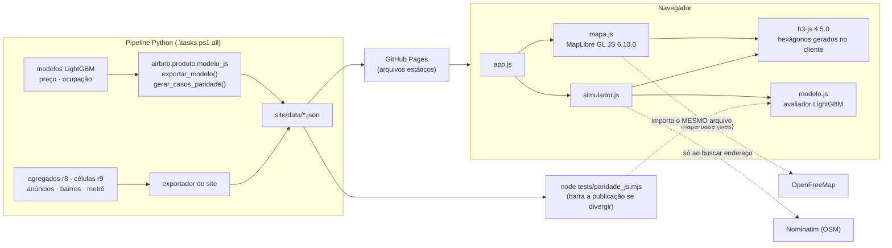

# 6 · Implantação — o site público

> Fase 6 do CRISP-DM. O modelo validado chega ao público como um site estático
> (GitHub Pages) que roda o **mesmo** modelo no navegador — paridade verificada a cada
> exportação e no CI. Os números de paridade e de verificação abaixo são os dos dados
> reais exportados por `.	asks.ps1 site`.

## O que o site faz

Uma página estática, em português, para quem não é da área:

- **mapa de Nova York** com hexágonos H3 r8 coloridos pela medida escolhida
  (preço mediano, número de anúncios, variação 2019 → 2026, bolsões de preço
  LISA…), contorno dos bairros, anúncios de 2026 e estações de metrô;
- **teste de localização**: a pessoa escolhe um ponto (clique no mapa, busca de
  endereço ou centro do mapa pelo teclado), descreve o imóvel e recebe o preço
  por noite previsto pelo modelo (valor típico + faixa de 80%), o efeito da
  localização frente a uma área de referência, noites ocupadas e receita (se o
  modelo de ocupação existir), o contexto da área em 2019 e os anúncios
  parecidos mais próximos.

Tudo roda no navegador. Não há servidor, banco de dados nem chave de API.

## Arquitetura



| Componente | Onde roda | Custo | Ponto de falha e o que acontece |
|---|---|---|---|
| `site/data/*.json` | GitHub Pages (CDN do GitHub) | zero | arquivo ausente → mensagem na página, sem quebrar o resto |
| MapLibre GL JS 6.10.0 | navegador (vendorizada) | zero | sem WebGL 2 → aviso; o teste segue pela busca de endereço |
| h3-js 4.5.0 | navegador (vendorizada) | zero | — (mesmo núcleo H3 v4.5.0 do `h3` Python 4.5.0) |
| mapa-base OpenFreeMap | servidor de terceiros, sem chave | zero | fora do ar → fundo liso; hexágonos, bairros e pontos continuam |
| Nominatim | servidor da OSMF | zero (uso justo) | fora do ar → mensagem; clique no mapa continua |

## Contrato de dados (`site/data/`)

O exportador escreve exatamente estes arquivos; o site não tem nenhuma lista
de medidas, campos ou nomes codificada — tudo vem daqui.

| Arquivo | Conteúdo |
|---|---|
| `resumo.json` | datas, equipe e crédito (de `autoria.py`), KPIs 2019 × 2026, sobrevivência, métricas dos modelos, CPI, **`metricas_celula`** (o seletor do mapa), atribuições |
| `celulas_r8.json` | `{"colunas": ["h3", "bairro", "distrito", <chaves das métricas>], "linhas": [...]}` — só id + números; a geometria é gerada no navegador com `cellToBoundary` |
| `celulas_r9.json` | `{"colunas": [features de localização, na ordem do modelo], "celulas": {"<h3 r9>": [...]}, "referencia": "<h3 r9>"}` |
| `anuncios_2026.json` | `{"colunas": ["lat","lon","tipo","preco","previsto","bairro"], "linhas": [...], "tipos": [...]}` — **sem id de anúncio nem anfitrião** (invariante 9) |
| `bairros.geojson` · `metro.geojson` | contornos (`bairro`, `distrito`) e estações (`nome`, `linhas`) |
| `modelo_preco.json` · `modelo_ocupacao.json` | saída de `exportar_modelo()` (formato abaixo); ocupação é opcional |
| `_casos_paridade_*.json` | entradas + saídas do próprio LightGBM, para o teste em Node |

Chaves opcionais que o site entende (todas documentadas em
`src/airbnb/produto/modelo_js.py`):

| Onde | Chave | Para quê |
|---|---|---|
| `metricas_celula[]` | `papel` | liga a medida à frase de contexto do simulador: `anuncios_2019`, `preco_2019`, `anuncios_2026`, `preco_2026`, `var_anuncios_pct`, `var_preco_pct`. Sem `papel`, vale a chave: `n_2026`, `var_n_pct`, `preco_2026`, `var_preco_real_pct` (e `n_2019`, `preco_2019_real`) |
| `metricas_celula[]` | `nulo` | explica, na dica do mapa, por que a célula não tem valor (padrão: "esta medida não está disponível para esta área") |
| `metricas_celula[]` | `neutro` | meia-largura da classe "sem variação" das escalas divergentes, na unidade dos dados (padrão: 5% do p95 de \|v\|) |
| `metricas_celula[]` | `unidade: "fração"` | valores de 0 a 1 exibidos em % |
| `resumo.json` | `modelo_ocupacao: false` | o site nem pede `modelo_ocupacao.json`. Sem a chave, o site tenta carregar; se o arquivo não existir, omite a seção (o navegador registra o 404 de rede, sem erro de JavaScript) |
| `resumo.kpis[ano]` | `precos_por_estadia: {curta, longa}` | se existir, o cabeçalho mostra o preço estratificado por estadia (invariante 8) no lugar do preço único |
| modelo | `features_fixas` | valores fixos no simulador para features que o usuário não informa |
| modelo | `intervalo_por_grupo` | quantis conformais por grupo (ex.: tipo de acomodação), usados no lugar do global |
| modelo | `chave_tipo` | entrada cujo código indexa `anuncios_2026.tipos` (filtro dos comparáveis); sem ela, `room_type_cod` |
| modelo | `teto` | limite da previsão exibida (255 noites/ano no modelo de ocupação) |
| modelo · `celulas_r9` | `rotulos` | nomes legíveis das features no "como chegamos nesse número?" |

Unidades: `"%"` aparece nos dados com duas convenções — variações em pontos
(`var_n_pct` vai de −100 a +271) e fatias em fração (`pct_min30_2026`,
`sobrevivencia`, de 0 a 1). O site decide por medida: `"%"` com todos os
\|v\| ≤ 1 é fração e é multiplicado por 100. Nos KPIs, `pct_*` e
`sobrevivencia.pct` seguem a mesma regra (hoje vêm em fração); `mdape` e
`cobertura_80` aceitam fração ou pontos; `melhora_vs_baseline_pct` é pontos.
Declarar `"unidade": "fração"` nas fatias tira a ambiguidade.

## O modelo no navegador

### Por que não um servidor

- **Custo zero e nada para manter:** o site é um punhado de arquivos no GitHub
  Pages. Um backend exigiria hospedagem, chave, monitoramento — para um trabalho
  acadêmico que precisa continuar no ar depois da apresentação.
- **Privacidade:** o que a pessoa digita não sai do computador dela.
- **Auditável:** o modelo publicado é um JSON legível, e o avaliador tem ~130
  linhas de código. Qualquer um pode conferir que o número da tela é o do modelo.

### Formato `lightgbm-js/1`

`exportar_modelo(booster, caminho, *, features, transformacao, extras=None, init_score=0.0)`
lê `booster.dump_model()` e grava as árvores como **arrays paralelos**, com os
mesmos índices da estrutura `Tree` do LightGBM em C++:

```json
{
  "formato": "lightgbm-js/1", "lightgbm": "4.7.0", "objetivo": "regression",
  "features": ["room_type_cod", "accommodates", "...", "lat", "lon"],
  "transformacao": "expm1", "init_score": 0.0, "n_arvores": 350,
  "codigos": {"ausente": ["None", "Zero", "NaN"], "decisao": ["<=", "=="]},
  "arvores": [{
    "feature": [3, 0],          "limiar": [1.5, "0||2"],
    "esquerda": [1, -1],        "direita": [-3, -2],
    "padrao_esquerda": [1, 0],  "ausente": [2, 0],  "decisao": [0, 1],
    "folhas": [0.12, -0.05, 0.31]
  }],
  "entradas_usuario": ["..."], "features_local": ["..."], "intervalo": {"nivel": 0.8, "q_inf": -0.4, "q_sup": 0.4}
}
```

Filho `>= 0` é nó interno; `< 0` é a folha `~filho`. Limiar numérico para `<=`;
texto `"a||b||c"` para split categórico. Números saem com `repr` (ida e volta
exata de float64): nada é arredondado.

### Semântica reproduzida

`site/assets/modelo.js` implementa o `Tree::GetLeaf` do LightGBM 4.x:

1. `|x| <= 1e-35f` vira 0 ao montar a linha (o LightGBM descarta esses "zeros").
2. Split numérico, conforme o `missing_type` do nó: **None** — NaN vira 0 e
   compara; **Zero** — NaN vira 0, e zero segue `default_left`; **NaN** — NaN
   segue `default_left`, zero compara normalmente.
3. Split categórico: NaN ou negativo vai para a direita; senão trunca para
   inteiro e vai para a esquerda se a categoria está no conjunto.
4. Escore bruto = soma das folhas, árvore a árvore, na ordem, + `init_score`;
   previsão = `identidade`, `exp`, `expm1` ou `sigmoide` (com a escala do
   objetivo `binary sigmoid:k`).

O exportador **recusa** o que daria número errado sem avisar: ordem de features
diferente da do modelo, transformação incoerente com o objetivo (ex.: `expm1`
num poisson, que já devolve `exp`), multiclasse, `linear_tree`, `boosting=rf`, e
`extras` com feature sem origem no simulador.

## Paridade Python ↔ JavaScript (invariante 10)

`gerar_casos_paridade(booster, X, caminho, *, modelo, n=500, semente=42)` sorteia
linhas reais, força NaN e zero em parte delas e acrescenta linhas extremas (tudo
NaN, tudo zero, `|x| < 1e-35`, ±1e30 e, nas categóricas, código negativo,
fracionário e desconhecido). Grava as entradas e as saídas **do próprio
LightGBM** (escore bruto e previsão).

`node tests/paridade_js.mjs [modelo.json casos.json]` importa o **mesmo**
`site/assets/modelo.js` da página e reprova (exit 1) se:

- o escore bruto divergir mais que 1e-9 em qualquer caso;
- a previsão transformada divergir mais que 1e-9 relativo;
- a entrada como objeto `{nome: valor}` der número diferente da entrada como array;
- não houver caso com NaN ou com zero;
- features ou transformação dos dois arquivos não baterem;
- o intervalo exibido (par do grupo ou global, com teto) diferir do rederivado.

Resultado nos modelos reais (LightGBM 4.7.0, Node 22):

| Modelo | Árvores | Features | Casos | com NaN | com zero | Erro máx. bruto | Erro máx. previsão |
|---|---|---|---|---|---|---|---|
| preço (regressão no log → `exp`, intervalo por tipo) | 61 | 34 | 500 | 343 | 496 | **0** | 2,0e-16 (relativo) |
| ocupação (→ `exp`, teto 255) | 97 | 34 | 500 | 316 | 494 | **0** | 1,9e-16 (relativo) |

Nos dados provisórios (usados para montar o site, com `room_type_cod` como
categórica nativa do LightGBM) o resultado foi o mesmo: erro bruto 0 em 500
casos por modelo.

O escore bruto bate **bit a bit**: é a soma das mesmas folhas na mesma ordem em
IEEE 754. A diferença de 1e-16 na previsão é o último bit de `Math.exp`/`expm1`
contra a implementação do C++. `tests/test_modelo_js.py` repete a prova em dado
sintético para regressão em log1p, poisson com `zero_as_missing` (nós
`missing_type` Zero), tweedie e binário com `sigmoid=1.7`, e prova que o teste
**consegue falhar** (folhas alteradas em 1e-6 reprovam).

## O mapa

Escalas de cor definidas pelo `tipo` de cada medida em `resumo.json`:

| Tipo | Escala | Classes |
|---|---|---|
| `sequencial` | um matiz (azul), claro → escuro; invertida no tema escuro | 7 quantis — preço é assimétrico |
| `divergente` | azul ↔ neutro ↔ vermelho | neutro fixo no zero; cada braço com os próprios quantis |
| `categorica` | cores fixas; LISA na convenção Alto-Alto vermelho, Baixo-Baixo azul | uma por categoria |

Célula sem valor fica sem cor, com contorno tracejado, e a dica explica o motivo
(`nulo`). As cores dos anúncios por tipo (casa inteira, quarto privativo,
outros) são as dos distritos da v0 e passaram no validador de daltonismo para
mapas (todas as combinações, ΔE ≥ 8 sob protanopia e deuteranopia) nos dois
temas. Mais de três tipos no mesmo mapa não passa — por isso "compartilhado" e
"hotel" viram "outros".

## Limites e uso justo

| Limite | Situação | O que fazer se crescer |
|---|---|---|
| Tamanho dos dados | ~3,9 MB sem compressão nos dados reais (células r9 1,5 MB, anúncios 1,4 MB; os dois modelos somam 0,3 MB) + 1,9 MB de bibliotecas e fontes; o GitHub Pages serve com gzip | arredondar coordenadas a 5 casas (1 m; o Airbnb já desloca até 150 m), menos árvores, ou índice de bairro em vez de texto |
| Nominatim | só ao enviar a busca, no máximo 1 requisição por segundo, cache em memória, atribuição visível — como pede a [política de uso](https://operations.osmfoundation.org/policies/nominatim/) | nada automático (sem busca ao digitar) |
| OpenFreeMap | gratuito, sem chave, atribuição do TileJSON exibida no mapa | se sair do ar, o site já cai para fundo liso |
| Navegador | WebGL 2 obrigatório (MapLibre 6) | sem ele, aviso e simulador pela busca |

## Acessibilidade (WCAG 2.1 AA)

- **Contraste medido:** todo texto ≥ 4,5:1 nos três fundos de cada tema
  (`--ink-soft` 4,9:1 no pior caso claro; o tom decorativo de 2,5:1 nunca vai em texto).
- **Teclado:** link "Pular para o teste", foco visível de 3 px, mapa movido por
  setas (atalhos da MapLibre) e botão "Usar o centro do mapa" — dá para fazer o
  teste sem mouse, também pela busca de endereço.
- **Leitor de tela:** o resumo do resultado é `aria-live` (valor + faixa), sem
  reler o painel inteiro a cada ajuste; erros de campo com `aria-invalid` e texto.
- **Celular:** o painel vira folha inferior (abre sozinha ao escolher um ponto);
  sem rolagem horizontal. `prefers-reduced-motion` desliga transições e voo do mapa.

## Dependências vendorizadas

Nenhum JavaScript de CDN em tempo de execução. Tarballs do registro npm, com o
SHA-512 conferido contra o `dist.integrity` do registro:

| Pacote | Versão | Licença | Arquivos em `site/vendor/` |
|---|---|---|---|
| maplibre-gl | 6.10.0 | BSD-3-Clause | `maplibre-gl.mjs`, `-shared.mjs`, `-worker.mjs`, `.css`, `LICENSE.txt` |
| h3-js | 4.5.0 | Apache-2.0 | `h3-js.es.js` (build de navegador), `LICENSE`, `NOTICE` |
| Public Sans · Figtree | Google Fonts (subconjunto latino) | SIL OFL 1.1 | `fontes/*.woff2`, `OFL-*.txt` |

## Verificação feita

Chrome 153 headless, dirigido por CDP, sobre `python -m http.server`, com os
dados provisórios e depois com os reais:

- carga sem erro nem aviso de console, em desktop e celular (390 × 844), nos
  temas claro e escuro (inclusive escuro automático do sistema com movimento
  reduzido);
- conferência ponta a ponta: para cada célula clicada, o preço exibido é
  **idêntico** (diferença 0) ao recalculado em Python a partir do mesmo JSON —
  o que prova também a montagem das features no navegador (célula r9, campos
  do formulário, nota opcional vazia, features nulas da célula);
- clique no mapa, mudança de campos, campo inválido, ponto na água (fora da
  cobertura), "usar o centro do mapa", busca no Nominatim e escolha do resultado;
- seletor de medida com as três escalas; camadas de anúncios e metrô;
- sem modelo de ocupação — declarado no resumo (nenhum pedido) ou arquivo
  ausente (404 tratado, seção omitida) — e sem mapa-base (tiles bloqueados:
  fundo liso, aviso, simulador funcionando);
- ordem de foco pelo teclado.

**Não verificado:** leitor de tela real (NVDA, VoiceOver), Firefox e Safari,
aparelho físico, e desempenho com os dados reais (tamanho final dos JSON).

## Como publicar

A exportação é uma etapa do pipeline — ninguém monta JSON à mão:

```powershell
.	asks.ps1 site      # airbnb.produto.exportar + node tests/paridade_js.mjs
.	asks.ps1 figuras   # tabelas e figuras da documentação
.	asks.ps1 docs      # mkdocs build --strict
git add site/data docs data/processed/_*.json
git commit -m "Atualiza site e documentação"
git push               # o workflow pages publica
```

`src/airbnb/produto/exportar.py` treina o modelo final do produto no dado inteiro (com
o número de árvores que a CV escolheu), confere o JSON contra o LightGBM em Python
(`verificar_export` — aborta se divergir) e grava os casos de paridade para o Node.

**No GitHub** (`.github/workflows/`):

| workflow | quando | o que faz |
|---|---|---|
| `ci.yml` | push e pull request | ruff, pytest (sem o dado real), paridade JS do modelo **publicado**, `mkdocs build --strict` |
| `pages.yml` | push em `main` que toque `site/`, `docs/` ou `mkdocs.yml` | confere a paridade de novo, **recusa publicar dado marcado como provisório**, monta `site/` na raiz e a documentação em `/docs/`, publica no Pages |

O CI **não** reconstrói os dados (ADR 0003): publica o que foi gerado e verificado
localmente. Reconstruir exigiria baixar e reprocessar todas as fontes a cada push.

## Atualizar para um snapshot novo

1. Trocar `SNAPSHOT_ATUAL` em `src/airbnb/config.py` (datas em <https://insideairbnb.com/get-the-data/>).
2. `.	asks.ps1 dados --forcar` e `.	asks.ps1 all` — refaz fontes, células, modelos,
   site, figuras e documentação.
3. `.	asks.ps1 status` tem de fechar todas as etapas `ok`.
4. Reler os documentos cujos números mudaram (as tabelas se atualizam sozinhas; o texto
   corrido, não) e publicar.
